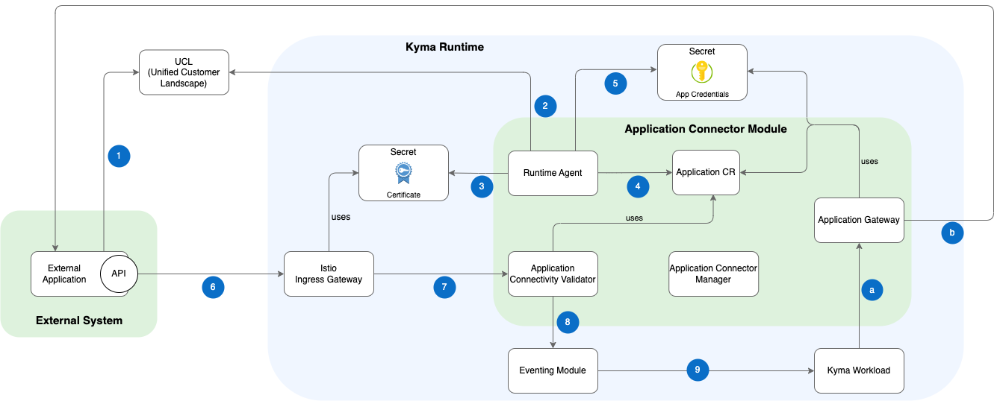

# Architecture

The following architectural diagram includes all components of the Application Connector module and describes the workflow for integrating an external system into Kyma using the different components.

## Components

To get more details about a particular component, please follow the link.

|Component|Purpose|
|--|--|
|External Application|The external system which wants to interact with your Kyma workload or should be called by it.|
|UCL|The UCL system implements the BTP Extensibility Concept and administrates system formations.|
|[Runtime Agent](./technical-reference/runtime-agent/README.md)|Runtime Agent is a client of the UCL system. It regularly synchronizes the defined system formations and integrates them into Kyma runtime.|
|Certificate Secret|Stores the UCL-managed certificates used for trusted communication between an external system and Kyma.|
|[Application Custom Resource (CR)](./resources/04-10-application.md)|Stores metadata of the external system (like endpoints, authentication method etc.). Each Application CR corresponds to a single external system.|
|Application Credentials Secret|Stores endpoint/API credentials of the external system.|
|[Istio Ingress Gateway](./technical-reference/02-10-istio-gateway.md)|The Application Connector Module uses an Istio Gateway as endpoint for incoming requests from external systems. The Gateway supports mTLS for establishing trusted connections between the external system and the Kyma Runtime.|
|Application Connectivity Validator|Verifies incoming requests by analying the certificate subject and passes the request to the Kyma eventing module.|
|Eventing Module|The Kyma Eventing Module is used for dispatching incoming requests from external systems to Kyma worloads.|
|Kyma Workload|Can be a customer workload (e.g. deployed applications) or any Kyma hosted serverless function.|
|[Application Gateway](./technical-reference/02-20-application-gateway.md)|This component acts as an proxy for outgoing communication from a Kyma workload to an external system. It supports various types of authentication methods.|
|Application Connector Manager|This Kubernetes Operator takes care of the installation and configuration of all Application Connector module components in the Kyma Runtime. It manages the lifecycle of the Application Connector module based on the dedicated ApplicationConnector custom resource (CR).|

## Workflow

The workflow in the diagram shows the steps from registering an external system at UCL until it is able to interact with Kyma workloads. Some steps are only relevant when the integartion of the external system is managed manually, but all of them will be applied when the integration happens automatically via UCL.

<table>
    <tr>
        <th>Step</th>
        <th>Description</th>
        <th>Manual integration</th>
        <th>Integration by UCL</th>
    </tr>
    <tr>
        <td colspan="4"><strong>Inbound communciation</strong></td>
    </tr>
    <tr>
        <td>1</td>
        <td>The external system is registered in the UCL system (Unified Customer Landscape) and configured in a UCL system formation for the Kyma Runtime.</td>
        <td></td>
        <td>X</td>
    </tr>
    <tr>
        <td>2</td>
        <td>Runtime Agent connects to the UCL system and gathers all registered applications for this Kyma Runtime.</td>
        <td></td>
        <td>X</td>
    </tr>
    <tr>
        <td>3</td>
        <td>The agent retrieves from UCL the cryptograhical certificates used for securing the communication between the external system and Kyma. The certificate is stored in a Kubernetes secret.</td>
        <td></td>
        <td>X</td>
    </tr>
    <tr>
        <td>4</td>
        <td>Additionally, application metadata of the external system (e.g. authentication type, API endpoints etc.) are stored in an Application custom resource (CR).</td>
        <td>X This manual step is applied by an administrator</td>
        <td>X Step is automatically applied by Runtime Agent</td>
    </tr>
    <tr>
        <td>5</td>
        <td>Finally, the Runtime Agent stores the credentials for accessing the API of an external system in a Kubernetes secret.
These credentials are used for outbound communication proxied by the Application Gateway.</td>
        <td></td>
        <td>X</td>
    </tr>
    <tr>
        <td>6</td>
        <td>The external systems communicate with the Kyma Runtime trough the Istio Ingress Gateway.</td>
        <td>X</td>
        <td>X</td>
    </tr>
    <tr>
        <td>7</td>
        <td>Istio gateway is using the provided certificate for securing the communication via mTLS.</td>
        <td></td>
        <td>X</td>
    </tr>
    <tr>
        <td>8</td>
        <td>Incoming calls are verified by the Connectivity Validator by investigating the subject of the certificate. It finally forwards the request to the inbound handler of the Eventing component.</td>
        <td></td>
        <td>X</td>
    </tr>
    <tr>
        <td>9</td>
        <td>Kyma workloads can receive incoming events and process them.</td>
        <td>X</td>
        <td>X</td>
    </tr>
    <tr>
        <td colspan="4"><strong>Onbound communciation</strong></td>
    </tr>
    <tr>
        <td>a</td>
        <td>The Application Gateway acts as an proxy for any outbound communication from a Kyma workload to an external system API.</td>
        <td>X</td>
        <td>X</td>
    </tr>
    <tr>
        <td>b</td>
        <td>The Application Gateway takes care about security and authentication during the conversation with the external system API.</td>
        <td>X</td>
        <td>X</td>
    </tr>
</table>

