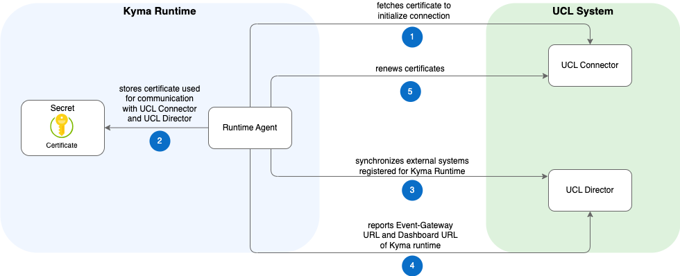

# Runtime Agent

The Runtime Agent acts as client for UCL (Unified Customer Landscape). His purpose is to integrate external systems, registered for Kyma in UCL, into the Kyma Runtime.

His responsibilities are:

- Regularly synchronizing external system (so called `Applications` in UCL) over the UCL Director by fetching new Applications from the  Director and integrating them into Kyma or removing those which no longer exist.

- Establishing (or renewing) a trusted connection between the Kyma Runtime and UCL services.

- Enable a birectional communication between external systems and Kyma runtimes, by uploading the Kyma runtime configuration (e.g. the Event Gateway URL) to the UCL backend. UCL shares these data with the external application. To learn more, read the section on [configuring the Runtime](./03-20-configuring-runtime.md).

## Architecture

The diagram illustrates the workflow of the Runtime Agent and the involved components.

### Components

|Component|Purpose|
|--|--|
|Runtime Agent|Client of the UCL system which integrates and synchronizes external applications with the Kyma Runtime. It also ensures a trusted communication with UCL services by exchanging certificates.|
|[UCL Connector](https://github.com/kyma-incubator/compass/blob/main/docs/connector/02-01-connector-service.md)|Connector establishes trust between external systems and and runtimes-|
|[UCL Director](https://github.com/kyma-incubator/compass/blob/master/docs/compass/02-01-components.md#director)|UCL Director handles the process of managing external systems and runtimes.|
|Certificate Secret|Stores the certificate used by the Runtime Agent to establish a trusted connection with a UCL service|

### Workflow

1. The Runtime Agent fetches the certificate from the UCL Connector to initialize connection with the UCL system.

2. The certificate and key for the UCL Connector and the UCL Director are stored in a Kuberentes Secret.

3. The agent synchronizes the Kyma integarted external systems with the UCL Director:

    * Fetching new external systems from the UCL Director and creating them in the Kyma Runtime

    * Removing from the KYma Runtime the external systems that no longer exist in the UCL Director.

4. It reports the Event Gateway URL and the Dashboard URL of the Kyma Runtime to the UCL Director. These URLs are also displayed in the UCL UI.

5. Regularly is a renewal of the certificate (used for the UCL Connector and the UCL Director communication) applied. This happens when the remaining validity for the certificate exhausts a certain threshold.

## Useful Links

If you're a developer and interested in learning more about Runtime Agent, follow these links to:

- [Tutorials](./tutorials/README.md) for Application Connector Developer
- Details about the [Connection](../../resources/04-20-compassconnection.md) custom resource (CR) for UCL (please be aware that UCL was previously called `Compass` - for historical reasons the CR is still named `CompassConnection`)
- How the [connection to UCL](./03-10-ucl-connection.md) is established
- Understand how the Runtime Agent [configures runtimes](./03-20-configuring-runtime.md)

